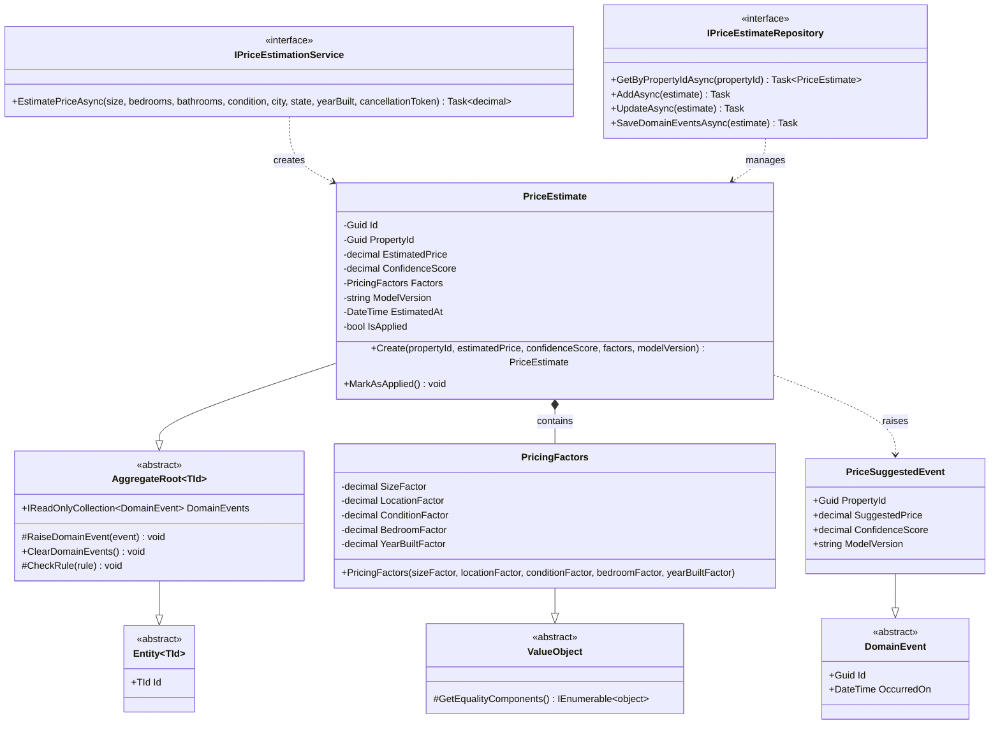

# PricingValuation Bounded Context - Class Diagram

## Overview
This bounded context handles property price estimation using various factors and pricing models.

## Class Diagram

## Key Components

### Aggregates
- **PriceEstimate**: Aggregate root that represents a price estimation for a property with confidence scoring

### Value Objects
- **PricingFactors**: Immutable value object containing all factors used in price calculation (size, location, condition, bedrooms, year built)

### Domain Events
- **PriceSuggestedEvent**: Raised when a price estimate is created, containing the suggested price and confidence score

### Domain Services
- **IPriceEstimationService**: Service interface for price estimation logic (implemented in Infrastructure layer)

### Repository
- **IPriceEstimateRepository**: Repository interface for price estimate persistence

## Relationships

1. **PriceEstimate** is the aggregate root that contains **PricingFactors** as a value object
2. **PriceEstimate** raises **PriceSuggestedEvent** when created
3. **IPriceEstimationService** provides the business logic for calculating price estimates
4. **IPriceEstimateRepository** manages persistence of **PriceEstimate** aggregates

## Business Flow

1. When a **PropertyRegisteredEvent** is received, the pricing service estimates the price
2. A **PriceEstimate** aggregate is created with pricing factors
3. **PriceSuggestedEvent** is raised and published
4. The PropertyManagement context receives the event and updates the property's suggested price

