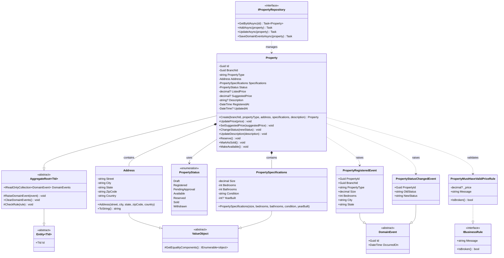

# PropertyManagement Bounded Context - Class Diagram

## Overview
This bounded context manages property registration, pricing, and status tracking.

## Class Diagram

## Key Components

### Aggregates
- **Property**: Main aggregate root that manages property lifecycle, pricing, and status transitions

### Value Objects
- **Address**: Immutable address value object with validation
- **PropertySpecifications**: Property specifications (size, bedrooms, bathrooms, condition, year built)

### Enums
- **PropertyStatus**: Represents the current state of a property (Draft, Registered, Available, Reserved, Sold, etc.)

### Domain Events
- **PropertyRegisteredEvent**: Raised when a property is first registered
- **PropertyStatusChangedEvent**: Raised when property status changes

### Business Rules
- **PropertyMustHaveValidPriceRule**: Ensures property prices are greater than zero

### Repository
- **IPropertyRepository**: Repository interface for property persistence

## Relationships

1. **Property** is the aggregate root that contains **Address** and **PropertySpecifications** as value objects
2. **Property** raises domain events when significant state changes occur
3. **Property** uses business rules to validate operations (e.g., price updates)
4. **IPropertyRepository** manages persistence of **Property** aggregates

