# SalesLoan Bounded Context - Class Diagram

## Overview
This bounded context manages loan applications and property sales transactions.

## Class Diagram

```mermaid
classDiagram
    class LoanApplication {
        -Guid Id
        -Guid PropertyId
        -Guid BranchId
        -CustomerInfo Customer
        -Money RequestedAmount
        -Money? ApprovedAmount
        -LoanStatus Status
        -string? RejectionReason
        -DateTime AppliedAt
        -DateTime? ReviewedAt
        -DateTime? ApprovedAt
        -bool IsPropertyReserved
        +Create(propertyId, branchId, customer, requestedAmount) LoanApplication
        +Approve(approvedAmount) void
        +Reject(reason) void
        +MarkAsUnderReview() void
        +ReserveProperty() void
        +MarkAsDisbursed() void
        +Close() void
    }

    class Sale {
        -Guid Id
        -Guid PropertyId
        -Guid BranchId
        -Guid CustomerId
        -CustomerInfo Customer
        -Money SaleAmount
        -Money? Commission
        -SaleStatus Status
        -DateTime SaleDate
        -DateTime CreatedAt
        -string? Notes
        +Create(propertyId, branchId, customerId, customer, saleAmount, notes) Sale
        +Confirm() void
        +Complete() void
        +Cancel(reason) void
        +SetCommission(commission) void
    }

    class CustomerInfo {
        -string FirstName
        -string LastName
        -string Email
        -string PhoneNumber
        -string? Address
        +string FullName
        +CustomerInfo(firstName, lastName, email, phoneNumber, address)
    }

    class Money {
        -decimal Amount
        -string Currency
        +Money(amount, currency)
        +operator+(left, right) Money
        +operator-(left, right) Money
        +ToString() string
    }

    class LoanStatus {
        <<enumeration>>
        Pending
        UnderReview
        Approved
        Rejected
        Disbursed
        Closed
    }

    class SaleStatus {
        <<enumeration>>
        Pending
        Confirmed
        Completed
        Cancelled
    }

    class LoanRequestedEvent {
        +Guid LoanApplicationId
        +Guid PropertyId
        +Guid BranchId
        +string CustomerEmail
        +decimal LoanAmount
    }

    class LoanApprovedEvent {
        +Guid LoanApplicationId
        +Guid PropertyId
        +Guid BranchId
        +decimal ApprovedAmount
    }

    class PropertyReservedEvent {
        +Guid PropertyId
        +Guid BranchId
        +Guid LoanApplicationId
    }

    class PropertySoldEvent {
        +Guid SaleId
        +Guid PropertyId
        +Guid BranchId
        +Guid CustomerId
        +decimal SaleAmount
        +DateTime SoldAt
    }

    class BranchPerformanceUpdatedEvent {
        +Guid BranchId
        +decimal TotalSales
        +int TotalLoans
        +DateTime UpdatedAt
    }

    class ApprovedAmountMustNotExceedRequestedAmountRule {
        -decimal _requestedAmount
        -decimal _approvedAmount
        +IsBroken() bool
        +string Message
    }

    class ILoanApplicationRepository {
        <<interface>>
        +GetByIdAsync(id) Task~LoanApplication~
        +GetByPropertyIdAsync(propertyId) Task~IEnumerable~LoanApplication~~
        +AddAsync(application) Task
        +UpdateAsync(application) Task
        +SaveDomainEventsAsync(application) Task
    }

    class ISaleRepository {
        <<interface>>
        +GetByIdAsync(id) Task~Sale~
        +GetByPropertyIdAsync(propertyId) Task~IEnumerable~Sale~~
        +AddAsync(sale) Task
        +UpdateAsync(sale) Task
        +SaveDomainEventsAsync(sale) Task
    }

    class AggregateRoot~TId~ {
        <<abstract>>
        +IReadOnlyCollection~DomainEvent~ DomainEvents
        #RaiseDomainEvent(event) void
        +ClearDomainEvents() void
        #CheckRule(rule) void
    }

    class Entity~TId~ {
        <<abstract>>
        +TId Id
    }

    class ValueObject {
        <<abstract>>
        #GetEqualityComponents() IEnumerable~object~
    }

    class DomainEvent {
        <<abstract>>
        +Guid Id
        +DateTime OccurredOn
    }

    class IBusinessRule {
        <<interface>>
        +IsBroken() bool
        +string Message
    }

    LoanApplication --|> AggregateRoot~Guid~
    Sale --|> AggregateRoot~Guid~
    AggregateRoot~Guid~ --|> Entity~Guid~
    LoanApplication *-- CustomerInfo : contains
    LoanApplication *-- Money : uses
    Sale *-- CustomerInfo : contains
    Sale *-- Money : uses
    LoanApplication --> LoanStatus : uses
    Sale --> SaleStatus : uses
    LoanApplication ..> LoanRequestedEvent : raises
    LoanApplication ..> LoanApprovedEvent : raises
    LoanApplication ..> PropertyReservedEvent : raises
    Sale ..> PropertySoldEvent : raises
    CustomerInfo --|> ValueObject
    Money --|> ValueObject
    LoanRequestedEvent --|> DomainEvent
    LoanApprovedEvent --|> DomainEvent
    PropertyReservedEvent --|> DomainEvent
    PropertySoldEvent --|> DomainEvent
    BranchPerformanceUpdatedEvent --|> DomainEvent
    ApprovedAmountMustNotExceedRequestedAmountRule ..|> IBusinessRule
    LoanApplication ..> ApprovedAmountMustNotExceedRequestedAmountRule : validates
    ILoanApplicationRepository ..> LoanApplication : manages
    ISaleRepository ..> Sale : manages
```

## Key Components

### Aggregates
- **LoanApplication**: Aggregate root managing loan application lifecycle from creation to approval/disbursement
- **Sale**: Aggregate root managing property sales transactions

### Value Objects
- **CustomerInfo**: Immutable customer information (name, email, phone, address)
- **Money**: Immutable monetary value with currency support and arithmetic operations

### Enums
- **LoanStatus**: Represents loan application states (Pending, UnderReview, Approved, Rejected, Disbursed, Closed)
- **SaleStatus**: Represents sale transaction states (Pending, Confirmed, Completed, Cancelled)

### Domain Events
- **LoanRequestedEvent**: Raised when a loan application is created
- **LoanApprovedEvent**: Raised when a loan is approved
- **PropertyReservedEvent**: Raised when a property is reserved for an approved loan
- **PropertySoldEvent**: Raised when a sale is completed
- **BranchPerformanceUpdatedEvent**: Raised when branch performance metrics are updated

### Business Rules
- **ApprovedAmountMustNotExceedRequestedAmountRule**: Ensures approved loan amount doesn't exceed requested amount

### Repositories
- **ILoanApplicationRepository**: Repository interface for loan application persistence
- **ISaleRepository**: Repository interface for sale persistence

## Relationships

1. **LoanApplication** and **Sale** are separate aggregate roots
2. Both aggregates use **CustomerInfo** and **Money** value objects
3. **LoanApplication** raises events for loan lifecycle events
4. **Sale** raises **PropertySoldEvent** when completed
5. **LoanApplication** validates approval amounts using business rules
6. Repositories manage persistence of both aggregates

## Business Flow

1. **Loan Application Flow**:
   - Customer creates loan application → **LoanRequestedEvent**
   - Application reviewed → Status changes to UnderReview
   - Application approved → **LoanApprovedEvent** raised
   - Property reserved → **PropertyReservedEvent** raised
   - Loan disbursed → Status changes to Disbursed
   - Loan closed → Status changes to Closed

2. **Sale Flow**:
   - Sale created → Status is Pending
   - Sale confirmed → Status changes to Confirmed
   - Sale completed → **PropertySoldEvent** raised, Status changes to Completed

