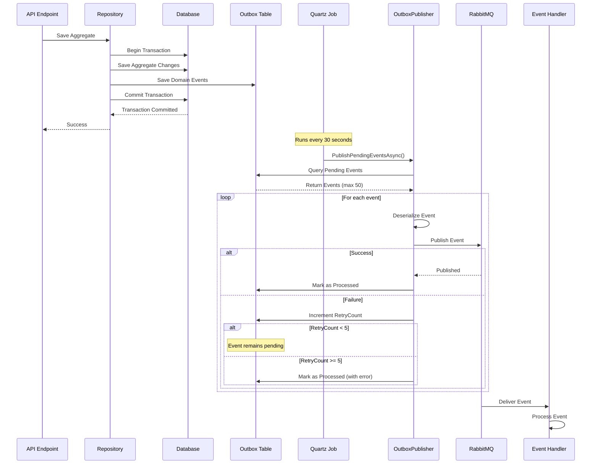

# Transactional Outbox Pattern Implementation

## Overview

The Transactional Outbox Pattern ensures reliable event publication in a distributed system. This implementation guarantees that domain events are never lost, even if the message broker (RabbitMQ) is temporarily unavailable.

## Architecture Diagram



## Components

### 1. OutboxMessage Entity

Stores domain events in the database with the following structure:

```csharp
public class OutboxMessage
{
    public Guid Id { get; set; }                    // Event ID
    public string Type { get; set; }                 // Fully qualified event type name
    public string Content { get; set; }              // JSON serialized event
    public DateTime OccurredOn { get; set; }         // When event occurred
    public DateTime? ProcessedOn { get; set; }       // When event was published (null = pending)
    public string? Error { get; set; }               // Error message if processing failed
    public int RetryCount { get; set; }               // Number of retry attempts
}
```

### 2. OutboxDbContext

Entity Framework Core context for the outbox table:

```csharp
public class OutboxDbContext : DbContext
{
    public DbSet<OutboxMessage> OutboxMessages { get; set; }
    
    // Index on (ProcessedOn, OccurredOn) for efficient querying
}
```

### 3. OutboxPublisher

Background service that processes pending events:

**Key Responsibilities:**
- Queries pending events (where `ProcessedOn` is null)
- Orders by `OccurredOn` (oldest first) to maintain event ordering
- Processes up to 50 events per run
- Deserializes events using reflection
- Publishes to RabbitMQ via `IEventBus`
- Updates event records with `ProcessedOn` timestamp
- Handles errors and implements retry logic

### 4. OutboxPublisherJob

Quartz.NET scheduled job that triggers the publisher:

- Runs every 30 seconds
- Uses `[DisallowConcurrentExecution]` to prevent overlapping runs
- Calls `OutboxPublisher.PublishPendingEventsAsync()`

### 5. RabbitMQEventBus

Publishes events to RabbitMQ:
- **Exchange**: `realestate_events` (Topic exchange)
- **Routing Key**: Event class name (e.g., `PropertyRegisteredEvent`)
- **Message Properties**: Event ID, timestamp, event type

## Implementation Flow

### Step 1: Event Creation and Storage

When a domain event is raised in an aggregate:

```csharp
// In Repository (Infrastructure layer)
public async Task SaveDomainEventsAsync<T>(T aggregate, CancellationToken cancellationToken = default)
    where T : AggregateRoot<Guid>
{
    var domainEvents = aggregate.DomainEvents.ToList();
    aggregate.ClearDomainEvents();

    foreach (var domainEvent in domainEvents)
    {
        var outboxMessage = new OutboxMessage
        {
            Id = domainEvent.Id,
            Type = domainEvent.GetType().AssemblyQualifiedName!,
            Content = JsonSerializer.Serialize(domainEvent, domainEvent.GetType()),
            OccurredOn = domainEvent.OccurredOn,
            RetryCount = 0
        };
        
        _outboxContext.OutboxMessages.Add(outboxMessage);
    }

    await _outboxContext.SaveChangesAsync(cancellationToken);
}
```

**Important**: This happens in the **same database transaction** as the aggregate changes, ensuring atomicity.

### Step 2: Background Processing

The Quartz job runs periodically:

```csharp
public async Task PublishPendingEventsAsync(CancellationToken cancellationToken = default)
{
    // Query pending events (oldest first)
    var pendingMessages = await _context.OutboxMessages
        .Where(m => m.ProcessedOn == null)
        .OrderBy(m => m.OccurredOn)
        .Take(50)
        .ToListAsync(cancellationToken);

    foreach (var message in pendingMessages)
    {
        try
        {
            // Deserialize event
            var domainEvent = DeserializeEvent(message);
            if (domainEvent != null)
            {
                // Publish to RabbitMQ
                await _eventBus.PublishAsync(domainEvent, cancellationToken);
                
                // Mark as processed
                message.ProcessedOn = DateTime.UtcNow;
                message.Error = null;
            }
        }
        catch (Exception ex)
        {
            // Handle error and retry
            message.RetryCount++;
            message.Error = ex.Message;
            
            // After 5 retries, mark as processed to prevent infinite retries
            if (message.RetryCount >= 5)
            {
                message.ProcessedOn = DateTime.UtcNow;
                message.Error = $"Max retries exceeded: {ex.Message}";
            }
        }
    }

    await _context.SaveChangesAsync(cancellationToken);
}
```

### Step 3: Retry Logic

**Retry Strategy:**
1. On failure, `RetryCount` is incremented
2. Error message is stored
3. Event remains pending (`ProcessedOn` stays null)
4. Next job run will attempt to process again
5. After 5 retries, event is marked as processed with error message (prevents infinite retries)

**Retry Scenarios:**
- **Deserialization Errors**: Event type not found or invalid JSON
- **RabbitMQ Connection Errors**: Broker unavailable or network issues
- **Publishing Errors**: Exchange/routing key issues

## Database Schema

```sql
CREATE TABLE OutboxMessages (
    Id UNIQUEIDENTIFIER PRIMARY KEY,
    Type NVARCHAR(500) NOT NULL,
    Content NVARCHAR(MAX) NOT NULL,
    OccurredOn DATETIME2 NOT NULL,
    ProcessedOn DATETIME2 NULL,
    Error NVARCHAR(MAX) NULL,
    RetryCount INT NOT NULL DEFAULT 0
)

CREATE INDEX IX_OutboxMessages_ProcessedOn_OccurredOn 
ON OutboxMessages (ProcessedOn, OccurredOn)
```

**Index Purpose**: Efficiently query pending events ordered by occurrence time.

## Configuration

### Quartz.NET Job Schedule

Configured in `appsettings.json`:

```json
{
  "Quartz": {
    "OutboxPublisherJob": {
      "IntervalSeconds": 30
    }
  }
}
```

### RabbitMQ Connection

```json
{
  "RabbitMQ": {
    "HostName": "localhost",
    "Port": 5672,
    "UserName": "guest",
    "Password": "guest",
    "ExchangeName": "realestate_events"
  }
}
```

## Benefits

1. **Reliability**: Events are never lost, even if RabbitMQ is down
2. **Consistency**: Events are stored in the same transaction as aggregate changes
3. **Ordering**: Events are processed in chronological order (oldest first)
4. **Retry Logic**: Failed events are automatically retried up to 5 times
5. **Monitoring**: Failed events can be queried and monitored
6. **Idempotency**: Event ID ensures no duplicate processing

## Error Handling

### Deserialization Errors
- Event type not found in assemblies
- Invalid JSON content
- **Action**: Increment retry count, store error, keep pending

### RabbitMQ Errors
- Connection failures
- Exchange/routing key issues
- **Action**: Increment retry count, store error, keep pending

### Max Retries Exceeded
- After 5 failed attempts
- **Action**: Mark as processed with error message
- **Rationale**: Prevents infinite retry loops and database bloat

## Monitoring Queries

### Query Pending Events
```sql
SELECT * FROM OutboxMessages 
WHERE ProcessedOn IS NULL
ORDER BY OccurredOn ASC
```

### Query Failed Events
```sql
SELECT * FROM OutboxMessages 
WHERE ProcessedOn IS NOT NULL 
  AND Error IS NOT NULL
ORDER BY OccurredOn DESC
```

### Query Events by Retry Count
```sql
SELECT * FROM OutboxMessages 
WHERE RetryCount > 0
ORDER BY RetryCount DESC, OccurredOn ASC
```

### Statistics
```sql
SELECT 
    COUNT(*) as TotalEvents,
    SUM(CASE WHEN ProcessedOn IS NULL THEN 1 ELSE 0 END) as PendingEvents,
    SUM(CASE WHEN ProcessedOn IS NOT NULL AND Error IS NULL THEN 1 ELSE 0 END) as ProcessedEvents,
    SUM(CASE WHEN Error IS NOT NULL THEN 1 ELSE 0 END) as FailedEvents,
    AVG(RetryCount) as AvgRetryCount
FROM OutboxMessages
```

## Event Flow Example

1. **Property Registration**:
   - API receives request to register property
   - `Property.Create()` raises `PropertyRegisteredEvent`
   - Repository saves property and event to outbox (same transaction)
   - Transaction commits

2. **Event Processing** (30 seconds later):
   - Quartz job triggers
   - `OutboxPublisher` queries pending events
   - Finds `PropertyRegisteredEvent`
   - Deserializes event
   - Publishes to RabbitMQ exchange `realestate_events` with routing key `PropertyRegisteredEvent`
   - Marks event as processed

3. **Event Consumption**:
   - PricingValuation module subscribes to `PropertyRegisteredEvent`
   - Handler receives event
   - Triggers price estimation
   - Creates `PriceEstimate` aggregate
   - Raises `PriceSuggestedEvent`
   - Event saved to outbox (cycle repeats)

## Future Enhancements

1. **Dead Letter Queue**: Move permanently failed events to DLQ for manual review
2. **Metrics Dashboard**: Real-time monitoring of event processing
3. **Configurable Retry Strategies**: Exponential backoff, custom retry counts
4. **Event Deduplication**: Prevent duplicate event processing
5. **Distributed Locking**: Support multi-instance deployments with distributed locks
6. **Batch Processing**: Configurable batch sizes
7. **Priority Queues**: Process critical events first
8. **Event Versioning**: Handle event schema evolution

## Troubleshooting

### Events Not Being Processed
- Check if Quartz job is running
- Verify RabbitMQ connection
- Check for errors in outbox table
- Review job logs

### High Retry Counts
- Check RabbitMQ availability
- Verify network connectivity
- Review event serialization
- Check for schema mismatches

### Performance Issues
- Adjust batch size (currently 50)
- Optimize database index
- Consider partitioning outbox table
- Review query performance

